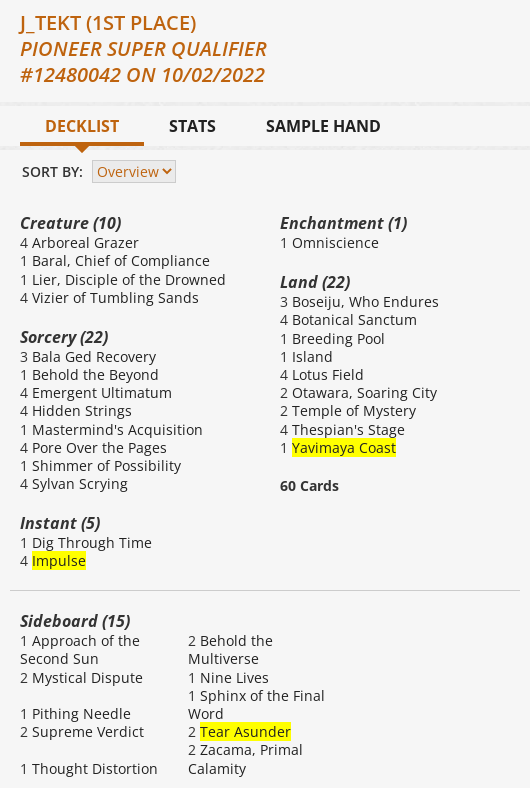

# MTGO Results Scraper

## Description
Scrape any of the results Wizards releases for MTGO.

For reference here is what the page looks like for a single deck:



Here's the corresponding output:

```
{'Mainboard': {"Archmage's Charm": 3,
               'Brazen Borrower': 1,
               'Consider': 4,
               'Counterspell': 4,
               'Expressive Iteration': 4,
               'Fiery Islet': 1,
               'Fire // Ice': 1,
               'Flooded Strand': 3,
               'Force of Negation': 1,
               'Ledger Shredder': 4,
               'Lightning Bolt': 3,
               "Mishra's Bauble": 4,
               'Murktide Regent': 3,
               'Otawara, Soaring City': 1,
               'Polluted Delta': 2,
               'Ragavan, Nimble Pilferer': 4,
               'Scalding Tarn': 2,
               'Snow-Covered Island': 3,
               'Spell Pierce': 1,
               'Spirebluff Canal': 4,
               'Steam Vents': 3,
               'Unholy Heat': 4},
 'Player': 'fer_magic',
 'Sideboard': {'Chandra, Awakened Inferno': 1,
               'Dress Down': 1,
               'Engineered Explosives': 2,
               'Flusterstorm': 2,
               'Fury': 1,
               'Magus of the Moon': 2,
               'Mystical Dispute': 2,
               'Subtlety': 1,
               'Test of Talents': 1,
               'Unlicensed Hearse': 2}}
```

For output examples of `-s/--take-screenshots` look [here](examples/take-screenshots). The corresponding MTGO results link for the screenshots can be found [here](https://magic.wizards.com/en/articles/archive/mtgo-standings/pioneer-league-2022-06-02).

Install the requirements:

`pip install -r requirements.txt`

Other Dependencies:

```
Chrome
```

Here is the help menu for the tool:

```
usage: mtgo_results_scraper.py [-h] [-o OUTPUT_DIR] [-c] [-s] -u URL [-i]

Scrape and/or screenshot the Magic: The Gathering match results.

optional arguments:
  -h, --help            show this help message and exit
  -o OUTPUT_DIR, --output-dir OUTPUT_DIR
                        The directory to save content to.
  -c, --crop-screenshots
                        Crop the screenshots of the card preview.
  -s, --take-screenshots
                        Take screenshots of the decks.
  -u URL, --url URL     The page to start at or create screenshots of.
  -i, --upload-to-imgur
                        Create an Imgur album and upload deck images to it.
  ```